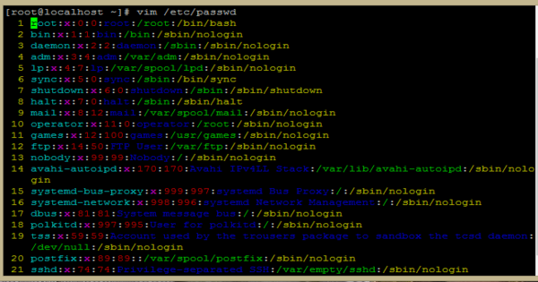

# Management d'utilisateurs et de groupes dans CentOS

## Types d'utilisateurs
Il existe 3 types d'utilisateurs : 
* __Super utilisateur__ : C'est le big boss, il a les pleins pouvoirs sur l'ensemble du système. Créer lors de l'installation du système.
* __Utilisateur système__ : Utilisateurs créer par le système pour le système. Ex : bin, games, ftp, name, mail, daemon, apache etc. C'est utilisateurs de peuvent pas se loger au système car par défaut leur "login shell" est sur  "nologin".
* __Utilisateur régulier__ : Créer par le super utilisateur, l'utilisateur régulier a des droits limités, accordés par le super, pour utiliser le système. L'utilisateur régulier peut être :  ftp user, a samba user or a mail user par exemple.



## Créer un utilisateur

L'ajout d'utilisateur se fait via la commande __useradd__.
```
Usage: useradd [options] LOGIN
       useradd -D
       useradd -D [options]

Options:
  -b, --base-dir BASE_DIR       base directory for the home directory of the
                                new account
  -c, --comment COMMENT         GECOS field of the new account
  -d, --home-dir HOME_DIR       home directory of the new account
  -D, --defaults                print or change default useradd configuration
  -e, --expiredate EXPIRE_DATE  expiration date of the new account
  -f, --inactive INACTIVE       password inactivity period of the new account
  -g, --gid GROUP               name or ID of the primary group of the new
                                account
  -G, --groups GROUPS           list of supplementary groups of the new
                                account
  -h, --help                    display this help message and exit
  -k, --skel SKEL_DIR           use this alternative skeleton directory
  -K, --key KEY=VALUE           override /etc/login.defs defaults
  -l, --no-log-init             do not add the user to the lastlog and
                                faillog databases
  -m, --create-home             create the user's home directory
  -M, --no-create-home          do not create the user's home directory
  -N, --no-user-group           do not create a group with the same name as
                                the user
  -o, --non-unique              allow to create users with duplicate
                                (non-unique) UID
  -p, --password PASSWORD       encrypted password of the new account
  -r, --system                  create a system account
  -R, --root CHROOT_DIR         directory to chroot into
  -P, --prefix PREFIX_DIR       prefix directory where are located the /etc/* files
  -s, --shell SHELL             login shell of the new account
  -u, --uid UID                 user ID of the new account
  -U, --user-group              create a group with the same name as the user
  -Z, --selinux-user SEUSER     use a specific SEUSER for the SELinux user mapping
```

Lors ce qu'un utilisateur utilise cette commande, plusieurs actions sont réalisées :
* Ajoute une nouvelle entrée dans __/etc/passwd__ et __/etc/shadow__
* Ajoute une nouvelle entrée dans __/etc/group__ et __/etc/gshadow__
* Créer un repertoire __home__ pour le nouvelle utilisateur
* Ajoute les droits et permissions au repertoire __home__


### Utilisation
```
useradd aioli
```

Nous venons de créer l'utilisateur aioli, mais il faut lui configurer un mot de passe.

```
passwd aioli
```
```
# passwd aioli
Changement de mot de passe pour l'utilisateur aioli.
Nouveau mot de passe : 
```

## Que s'est-il passé !? 0_o

### 1. Nouvelle entrée dans /etc/passwd
Ce fichier est utilisé pour stocker les informations sur les utilisateurs. La commande __useradd_ ajoute une nouvelle ligne à ce fichier avec les informations entrées.

```
aioli:x:1001:1001::/home/aioli:/bin/bash
```

Chaque champs est séparé par des __":"__
```
aioli:x:1001:1001::/home/aioli:/bin/bash
1    :2: 3  : 4  :5:     6    :    7
```

| Champs N°        | Nom           | Valeure  | Description |
| ---------------- |:-------------:| :--------:| :-----------:|
| 1      | nom d'utilisateur | aioli | Compris entre 1 et 32 charactères, fournit lors de la création de l'utilisateur, il sert à  son authentification|
| 2      | mot de passe      |   x | Le charactère __X__ indique que le mot de passe est chiffré dans le fichier /etc/shadow. Si on remplace le __x__ par __*__ l'utilisateur ne pourra plus se connecter. Si on le retire il pourra se connecter sans mot de passe|
| 3      | ID utilisateur (UID)  |  1001 | User Identification Number, tout utilisateur en a un. 0 => ROOT; 1-99 => autres utilisateurs prédéfinis; 100-999 => Utilisateurs systèmes; 1000-XXXX => Utilisateurs réguliers|
| 4      | ID groupe (GID)  |  1001 | Groupe principale de l'utilisateur. Quand un utilisateur est créer, un groupe en son nom est généréet lui est affecté. Il peut avoir plusieurs groupes.|
| 5      | Commentaire (optionnel)  |   | Juste du commentaire |
| 6      | Repertoire __home__  |  /home/aioli | Chemin vers le repertoire __home__ de l'utilisateur. Si blanc, le repertoire racine __/__ est utilisé.|
| 7      | SHELL utilisateur  |  /bin/bash | Chemin vers le shell utilisé|

### 2. Nouvelle entrée dans /etc/shadow
Ce fichier sert à la gestion des mot de passes des utilisateurs. Le mot de passe chiffré vu précedement est stocké ici.

```
aioli:$6$stHFnKJOnqjUzHlH$K3QnPn0iam.3dlpe6BQpioMJBb4iMpapJzbX0.yYWoEVDCcESsj05hadC1QXgsuM4rnbITEYXyaq8/1Xh9naA0:18490:0:99999:7:::
```

Chaque champs est séparé par des __":"__
```
aioli:$6$stHFnKJOnqjUzHlH$K3QnPn0iam.3dlpe6BQpioMJBb4iMpapJzbX0.yYWoEVDCcESsj05hadC1QXgsuM4rnbITEYXyaq8/1Xh9naA0:18490:0:99999:7:::

1:2:3:4:5:6:7:8:9
```


