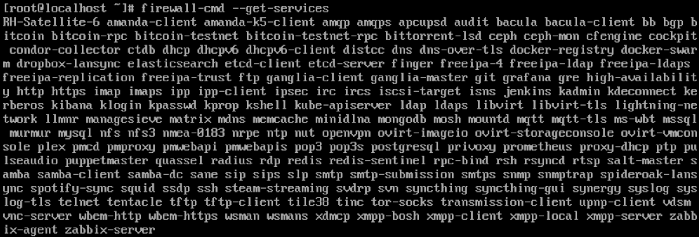
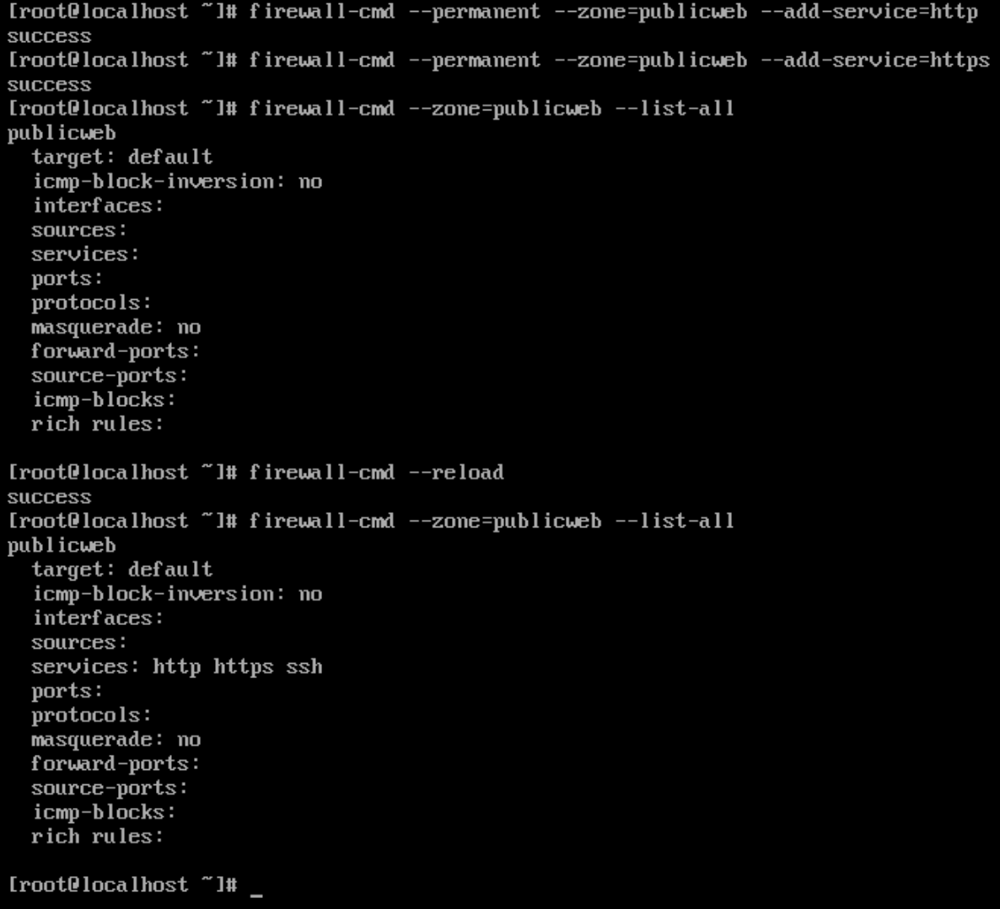

# Mise en place de règles firewall
##### source : https://www.digitalocean.com/community/tutorials/how-to-set-up-a-firewall-using-firewalld-on-centos-7

# firewall-cmd
## Concept
Le processus __wirewalld__ gère des groupes de règles appelés __zones__.
Une __zone__ et un ensemble de règle qui défini les actions à réaliser sur le traffic réseau.
Le tout en se basant sur un système de __niveau de confiance__.

### Les zones prédéfinies
* __drop__ : The lowest level of trust. All incoming connections are dropped without reply and only outgoing connections are possible.

* __block__ : Similar to the above, but instead of simply dropping connections, incoming requests are rejected with an icmp-host-prohibited or icmp6-adm-prohibited message.

* __public__ : Represents public, untrusted networks. You don’t trust other computers but may allow selected incoming connections on a case-by-case basis.

* __external__ : External networks in the event that you are using the firewall as your gateway. It is configured for NAT masquerading so that your internal network remains private but reachable.

* __internal__ : The other side of the external zone, used for the internal portion of a gateway. The computers are fairly trustworthy and some additional services are available.

* __dmz__ : Used for computers located in a DMZ (isolated computers that will not have access to the rest of your network). Only certain incoming connections are allowed.

* __work__ : Used for work machines. Trust most of the computers in the network. A few more services might be allowed.
home: A home environment. It generally implies that you trust most of the other computers and that a few more services will be accepted.

* __trusted__ : Trust all of the machines in the network. The most open of the available options and should be used sparingly.

### Rules
Les règles peuvent être permanantes ou immédiates, les règles immédiates sont supprimés à chaque reboot.

## Installation
* firewalld vient par défaut dans la pluspart des distributions linux, dont CentOs.

* Sinon il faut l'installer comme suit : 
```
sudo yum install firewalld
```

```
sudo systemctl enable firewalld
sudo reboot
```

* Voir le status de firewalld
```
sudo firewall-cmd --state
```


## usage
* Zone par defaut
```
sudo firewall-cmd --get-default-zone
```

* Zone active et sur quelles interfaces
```
sudo firewall-cmd --get-active-zones
```


__On peut voir qu'une seul interface est gérer par le parfeu, configuré en zone public__

* Voir toutes les règles sur la zone active
```
sudo firewall-cmd --list-all
```


Notes : Les port 80 et 443 proviennent d'une autre configuration.

* Voir toutes les zones disponibles
```
firewall-cmd --get-zones
```

* Voir toutes les règles de toutes les zones : 
```
sudo firewall-cmd --list-all-zones
```

## Configurer une interface avec une zone
* De base, toutes les interfaces sont configurer sur la zone par defaut

### Affecter une interface à une zone
```
sudo firewall-cmd --zone=home --change-interface=eth0
```

### Changer la zone par defaut
* Toutes les interfaces qui sont configurés sur la zone par défaut seront changées.
```
sudo firewall-cmd --set-default-zone=home
```

### Manager les services
#### Afficher tous les services
```
sudo firewall-cmd --get-services
```


* Le dossier ```/usr/lib/firewalld/services/``` contient les fichiers xml de chaque service, donnant plus d'informations.


#### Ajouter un service à une zone
```
sudo firewall-cmd --zone=public --add-service=http
```
* Arguments optionnels : 
- __--zone :__ si non précisé => zone par defaut
- __--permanent :__ si non précisé => regle temporaire

#### Voir les services liés à une zone : 
```
sudo firewall-cmd --zone=public --list-services
```


#### Créer un service
Avec le temps et le nombre de règles, il peut-être difficile de se rappeller pourquoi cette règle ? pourquoi ce port ? etc dans la configuration des zones.

Il est possible de créer dun service, de lui attribuer un nom, une description et des ports ouverts.
Il ne restera plus qu'à ajouter, ou non, le service à une zone.

* Copier/coller un service déjà existant dans ```/usr/lib/firewalld/services/``` et renomer le comme désiré.
````
sudo cp /usr/lib/firewalld/services/bitcoin.xml /usr/lib/firewalld/services/plex.xml
````

* Modifier le fichier de configuration


* Recharger firewalld
```
sudo firewall-cmd --reload
```

### zones
#### Créer une zone

* Il peut-être utile de créer ses propres zones quand celle de base ne nous conviennent pas, créées en nous une pour un serveur web.

```
sudo firewall-cmd --permanent --new-zone=publicweb
```

__Il faut recharger firewalld pour prendre en compte la nouvelle zone__
```
sudo firewall-cmd --reload
```

* Ajoutons-y quelques règles, sans oublier de recharger par la suite.
```
sudo firewall-cmd --zone=publicweb --add-service=ssh
sudo firewall-cmd --zone=publicweb --add-service=http
sudo firewall-cmd --zone=publicweb --add-service=https
sudo firewall-cmd --zone=publicweb --list-all
```



* Affectons notre nouvelle zone à une interface
```
sudo firewall-cmd --zone=publicweb --change-interface=ens33
```


### Ports
#### Ouvir un port pour une zone
```
sudo firewall-cmd --zone=public --add-port=80/tcp
sudo firewall-cmd --zone=public --add-port=4990-4999/udp
```

#### Liste des ports ouvert sur une zone
```
sudo firewall-cmd --zone=public --permanent --list-ports
```

# iptables
__Depuis CentOS 7, iptables est déprécié, il est conseillé d'utiliser firewalld__.
#### source : https://linoxide.com/firewall/setup-iptable-rules-centos/

* Liste des règles
```
sudo iptables -L
```

### Exemples

* Affiche le status d'IP table
```
iptables -L -n -v
```

* Block NULL paquets
```
iptables -A INPUT -p tcp --tcp-flags ALL NONE -j DROP
```

* Block SYN flood attaque
```
iptables -A INPUT -p tcp ! --syn -m state --state NEW -j DROP
```

* Block Recon paquet
```
iptables -A INPUT -p tcp --tcp-flags ALL ALL -j DROP
```

* Autorise addresse de loopback
```
iptables -A INPUT -i lo -j ACCEPT
```

* Autorise le traffic web
```
iptables -A INPUT -p tcp -m tcp --dport 80 -j ACCEPT
iptables -A INPUT -p tcp -m tcp --dport 443 -j ACCEPT
```

* Autorise les le traffic smtp
```
iptables -A INPUT -p tcp -m tcp --dport 25 -j ACCEPT
iptables -A INPUT -p tcp -m tcp --dport 465 -j ACCEPT
```

* Autorise SSH Globalité
```
iptables -A INPUT -p tcp -m tcp --dport 22 -j ACCEPT
```

* Autorise SSH depuis une source
```
iptables -A INPUT -p tcp -s YOUR_IP_ADDRESS -m tcp --dport 22 -j ACCEPT
```

* Autorise une connection sortante établie à recevoir une réponse
```
iptables -I INPUT -m state --state ESTABLISHED,RELATED -j ACCEPT
```

* Bannir une adresse IP
```
iptables -A INPUT -s IP_ADDRESS -j DROP
```

* Bannir un port d'une certaine adresse
```
iptables -A INPUT -p tcp -s IP_ADDRESS --dport PORT -j DROP
```

* Autoriser l'accès à  un port pour une certaine adresse IP
```
iptables -A INPUT -p tcp -s IP_ADDRESS --dport PORT -j ACCEPT
```

* Open DNS
```
iptables -A INPUT -m state --state NEW -p tcp --dport 53 -j ACCEPT
```

* Autoriser l'accès MYSQL port
```
iptables -A INPUT -p tcp --dport 3306 -j ACCEPT
```

* Autorise l'accès sur une palge de port
```
iptables -A INPUT -m state --state NEW -m tcp -p tcp --dport 7000:7100 -j ACCEPT
```

### Sauvegarder les règles et recharger iptable
```
service iptables save
service iptables restart
```


