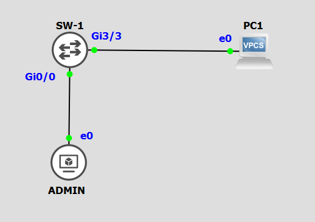
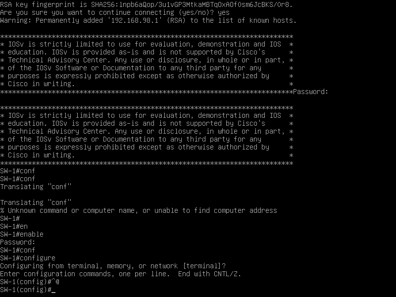

# Deployer - VLAN de management :

Ressources :

* [https://reussirsonccna.fr/configurer-interface-vlan-administration-du-switch/](https://reussirsonccna.fr/configurer-interface-vlan-administration-du-switch/) 


## 0 Le laboratoire :


<div align="center">***Illustration 1 :*** *Le laboratoire.*</div>


## 1 Configuration :
Un VLAN de management permet de manager un switch via un accès in-band (avec une configuration IP).
L'accès a cet equipement peut être possible via différents protocoles applicatifs :

* Telnet,
* SSH,
* HTTP,

Pour pouvoir accéder à ce services, il est nécessaire de définir une SVI (Switch Virtual Interface), avec une configuration IP montée.
Il est possible que cette configuration IP soit définis par :

* Un serveur DHCP,
* L'admin réseau,

Les bonnes paratiques de sécurités veille à ce que le VLAN de management soit définis dans un VLAN spécifique.
Et que ce VLAN spécifique soit uniquement accessible par les administrateurs réseaux. (ACL)

Configuration sur le switch SW-1, partie système :
````text
Switch(config)# hostname SW-1

SW-1(config)# no ip domain-lookup
SW-1(config)# ip domain-name cisco.com

SW-1(config)# crypto key generate rsa modulus 4096
SW-1(config)# ip ssh version 2

SW-1(config)# line vty 0 15
SW-1(config-line)# login local
SW-1(config-line)# transport input ssh
SW-1(config-line)# exit

SW-1(config)# line console 0
SW-1(config-line)# login local
SW-1(config-line)# exit

SW-1(config)# enable algorithm-type scrypt secret guillaume

SW-1(config)# username admin privilege 7 algorithme-type scrypt secret worldskills
SW-1(config)# do wr
````

Configuration sur le switch SW-1, partie résau :
````text
SW-1(config)# vlan 98
SW-1(config-vlan)# name MANAGEMENT
SW-1(config-vlan)# no shutdown
SW-1(config-vlan)# exit

SW-1(config)# interface vlan 98
SW-1(config-if)# ip address 192.168.98.1 255.255.255.0
SW-1(config-if)# no shutdown
SW-1(config-if)# exit

SW-1(config)# interface GigabitEthernet 0/0
SW-1(config-if)# switchport mode access
SW-1(config-if)# switchport acces vlan 98
SW-1(config-if)# no shutdown
SW-1(config-if)# exit
````

## 2 Vérification :

Depuis le poste de l'administrateur je réalise une connxion SSH sur le service SSH du switch correspondant à la SVI configurée :
````bash
ssh admin@192.168.98.1
password: worldskills
````

Connexion réussie :

<div align="center">***Illustration 2 :*** *Connexion à SW-1.*</div>


Seul le poste de l'adminustrateur peut se connecter au SWitch étant donné que c'est le seul qui est placé dans le VLAN 98.
Dans ce contexte de l'architecture réseau, il n'y a pas de routeur, mais si il y avais un routeur il serait nécessaire d'isoler les deux réseaux (**ACL**) afin que le poste PC-1 ne puisse pas se connecter au switch SW-1.

Exemple d'acl :
````text
RT-1(config-nacl-ext)# deny any any 192.168.98.1 22 tcp
````

Cette ACL étendue, empêche la communication de nimorte quel hôte vers la SVI du switch sur le port 22 en utilisant le protocole TCP.

## 3 Renforcement de l'infrastructure :
### 3.1 CDP et LLDP :
Désactiver les protocoles de reconnaissance des voisins :
````text
SW-1(config)# no cdp run
SW-1(config)# no lldp run
````

### 3.2 ARP et DHCP :
DHCP snooping et DAI :
````text
SW-1(config)# ip dhcp snooping
SW-1(config)# ip dhcp snooping vlan 1,98
SW-1(config)# ip arp inspection vlan 1,98

SW-1(config)# arp access-list VLAN-1
SW-1(config-nacl)# permit ip host mac host
SW-1(config-nacl)# exit

SW-1(config)# arp access-list VLAN-98
SW-1(config-nacl)# permit ip host 192.168.98.2 mac host
SW-1(config-nacl)# exit
````

### 3.3 DTP :
Désactiver le protocoel DTP :
````text
SW-1(config)# interface range GigabitEthernet 0/0-3, GigabitEthernet 1/0-3, GigabitEthernet 2/0-3, GigabitEthernet 3/0-3
SW-1(config-if-range)# switchport mode access
SW-1(config-if-range)# switchport nonegotiate
````

### 3.4 Port Security :
Activer le DTP sur tous les ports :
```text
SW-1(config)# interface range GigabitEthernet 0/0-3, GigabitEthernet 1/0-3, GigabitEthernet 2/0-3, GigabitEthernet 3/0-3
SW-1(config-if-range)# switchport port-security
SW-1(config-if-range)# switchport port-security maximum 3
SW-1(config-if-range)# switchport port-security violation shutdown
SW-1(config-if-range)# switchport port-security mac-address sticky
````

Si plus de trois adresses sont référencé dans la table CAM du switch pour un port spécifique, le switch shutdown ce port.


### 3.5 Complément :
Pour conclure, shutdown manuellent (administratively down) tous les autres ports inutilisés par mesure de sécurité :
````text
SW-1(config)# interface range GigabitEthernet 0/1-3, GigabitEthernet 1/0-3, GigabitEthernet 2/0-3, GigabitEthernet 3/0-2 
SW-1(config-if-range)# shutdown
SW-1(config-if-range)# exit

SW-1(config)# do wr 
````