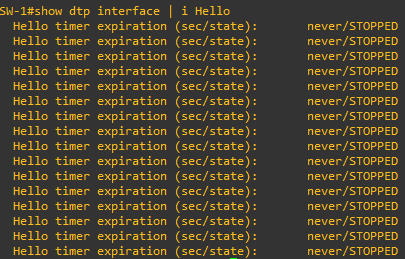
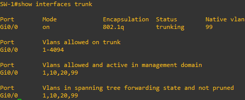
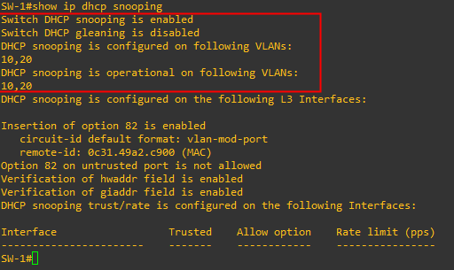
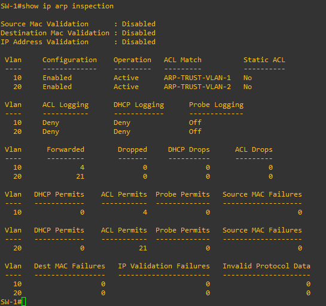
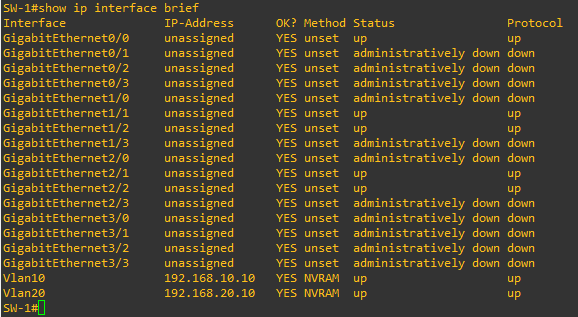

# Segmenter - les communications :

Ressources :

* [https://www.ciscomadesimple.be/2010/03/04/cisco-application-router-on-a-stick/](https://www.ciscomadesimple.be/2010/03/04/cisco-application-router-on-a-stick/)
* [https://www.cisco.com/c/en/us/td/docs/switches/datacenter/nexus5000/sw/configuration/guide/cli/CLIConfigurationGuide/PrivateVLANs.html](https://www.cisco.com/c/en/us/td/docs/switches/datacenter/nexus5000/sw/configuration/guide/cli/CLIConfigurationGuide/PrivateVLANs.html) 

---

## 1 Les VLAN et ACL :
Pour isoler des réseaux il est possible d'utiliser :

* Les VLAN pour limiter le domaine de diffusion (broadcast et multicast routable),
* Les ACL pour interdire les communication unicast d'un VLAN à un autre,

---

### 1.1 Le laboratoire :


<div align="center">***Illustration 1 :*** *Plan réseau du laboratoire.*</div>

Au sein de mon laboratoire, plusieurs vlan existe :

* VLAN 10, 192.168.10.0/24,
* VLAN 20, 192.168.20.0/24,
* VLAN 99, 192.168.99.0/24, (vlan natif)

---

### 1.2 Mise en pratique :

#### 1.2.1 VLAN et Router On a Stick :
Script de configuration du switch SW-1 :
````text
SW-1(config)# vlan 10
SW-1(config-vlan)# name vlan_1
SW-1(config-vlan)# no shutdown
SW-1(config-vlan)# exit
SW-1(config)# interface vlan 10
SW-1(config-if)# ip address 192.168.10.10 255.255.255.0
SW-1(config-if)# no shutdown
SW-1(config-if)# exit

SW-1(config)# vlan 20
SW-1(config-vlan)# name vlan_2
SW-1(config-vlan)# no shutdown
SW-1(config-vlan)# exit
SW-1(config)# interface vlan 20
SW-1(config-if)# ip address 192.168.20.10 255.255.255.0
SW-1(config-if)# no shutdown
SW-1(config-if)# exit

SW-1(config)# interface GigabitEthernet 1/1
SW-1(config-if)# switchport mode access
SW-1(config-if)# switchport access vlan 10
SW-1(config-if)# exit

SW-1(config)# interface GigabitEthernet 1/2
SW-1(config-if)# switchport mode access
SW-1(config-if)# switchport access vlan 10
SW-1(config-if)# exit
GigabitEthernet 1/2

SW-1(config)# interface GigabitEthernet 2/1
SW-1(config-if)# switchport mode access
SW-1(config-if)# switchport access vlan 20
SW-1(config-if)# exit

SW-1(config)# interface GigabitEthernet 2/2
SW-1(config-if)# switchport mode access
SW-1(config-if)# switchport access vlan 20
SW-1(config-if)# exit

SW-1(config)# interface GigabitEthernet 0/0
SW-1(config-if)# switchport trunk encapsulation dot1q
SW-1(config-if)# switchport mode trunk
SW-1(config-if)# switchport trunk allowed vlan 10,20
SW-1(config-if)# exit

SW-1(config)# do wr
````

Script de configuration de RT-1 :
````text
RT-1(config)# hostname RT-1

RT-1(config)# interface GigabitEthernet 0/0
RT-1(config-if)# no shutdown
RT-1(config-if)# exit

RT-1(config)# interface GigabitEthernet 0/0.10
RT-1(config-subif)# encapsulation dot1q 10
RT-1(config-subif)# ip address 192.168.10.254 255.255.255.0
RT-1(config-subif)# no shutdown
RT-1(config-subif)# exit

RT-1(config)# interface GigabitEthernet 0/0.20
RT-1(config-subif)# encapsulation dot1q 20
RT-1(config-subif)# ip address 192.168.20.254 255.255.255.0
RT-1(config-subif)# no shutdown
RT-1(config-subif)# exit
````

Configuration IP des postes :
````text
             @IP           MASK        Gateway
         ____________ ------------- ______________

PC-1> ip 192.168.10.1 255.255.255.0 192.168.10.254
PC-2> ip 192.168.10.2 255.255.255.0 192.168.10.254
PC-3> ip 192.168.20.1 255.255.255.0 192.168.20.254
PC-4> ip 192.168.20.2 255.255.255.0 192.168.20.254
````

Grâce à cette configuration, tous les postes peuvent se pinguer et les trames sont routées d'un VLAN à un autre.

Les tables de routages ont été dynamiquement créer par le routeur :
````
RT-1(config)# show ip route
````


<div align="center">***Illustration 2 :*** *Table de routage de RT-1.*</div>

A cette étape, les deux réseaux sont segmenter, c'est à dire que les trames de **broadcast** et **multicast** non routée ne traverse pas le routeur.
Mais les communications unicast peuvent encore traverser le routeur. Pour palier à cela il est nécessaire d'appliqer des ACL sur le routeur pour filtrer ces communications et rendre les deux réseaux étanches.


#### 1.2.2 ACL :
Tous les postes peuvent communiquer entre eux sur n'importe quel :

* N'importe quel hôte,
* Protocole (TCP/UDP),
* Port,

Il existe deux types d'ACL :

* ACL standart ne filtre que sur l'adresse IP source et destination,
* ACL étendue filtre sur l'adresse IP source, l'adresse IP de destination, le port source, le port de destination et le prtocole utilisé,

Ces ACL sont placé sur les interfaces et elles peuvent avoir deux positions :

* in,
* out,


<div align="center">***Illustration  3:*** *Chemin des trames*</div>

Isoler des réseaux à l'aide d'ACL.
Ces ACL seront positionée en out des interfaces virtuelle **GigabitEthernet0/0.10** et **GigabitEthernet0/0.20** du routeur **RT-1**.

Création de l'ACL n°10 qui interdit les hôtes du réseau 192.168.20.0/24 de communiquer avec le réseau 192.168.10.0/24 :
````text
RT-1(config)# ip access-list standard 10
RT-1(config-std-nacl)# deny 192.168.20.0 0.0.0.255 
RT-1(config-std-nacl)# exit
RT-1(config)# interface GigabitEthernet 0/0.10
RT-1(config-subif)# ip access-group 10 out
````

Création de l'ACL n°20 qui interdit les hôtes du réseau 192.168.10.0/24 de communiquer avec le réseau 192.168.20.0/24 :
````text
SW-1(config)# ip access-list standard 20
SW-1(config-std-nacl)# deny 192.168.10.0 0.0.0.255 
SW-1(config-std-nacl)# exit
SW-1(config)# interface GigabitEthernet 0/0.20
SW-1(config-subif)# ip access-group 20 out
````

Les deux **ACL** sont appliqué en **out**, dès qu'une trame transite par le routeur :

* Cas 1 Le champs IP source correspond à ce qui est deny dans l'ACL => le routeur drop,
* Cas 2 Le champs IP destination correspond à ce qui est deny dans l'ACL => le routeur drop
* Cas 3 Le champs IP source et destination ne correspond pas à ce qui est deny dans l'ACL => le routeur forward

La trame est transmise uniquement si l'adresse IP source ou destination n'est pas définis dans l'ACL.

---

### 1.3 Sécurisation de l'infrastructure :
Afin de renforcer la sécurité de l'infrastructure plusieurs points :

* Protéger les protocoles voisins,
* Eviter les attaques VLAN hopping,
* Protéger ARP, 
* Pas nécessaire de protéger DHCP car les postes sont définis en statique,

Protéger les protocoles voisins :
````text
RT-1(config)# no cdp run
RT-1(config)# no lldp run

SW-1(config)# no cdp run
SW-1(config)# no lldp run
````

Eviter les attaques de VLAN hopping (Switch spoof et double tag) :
````text
# DTP :
SW-1(config)# interface range GigabitEthernet 0/1-3, GigabitEthernet 1/0-3, GigabitEthernet 2/0-3, GigabitEthernet 3/0-3
SW-1(config-if-range)# switchport mode access
SW-1(config-if-range)# switchport nonegotiate
SW-1(config-if-range)# exit

SW-1(config)# interface range GigabitEthernet 0/0
SW-1(config-if-range)# switchport nonegotiate
SW-1(config-if)# exit

------------------------------------------------

# Native Vlan :
SW-1(config)# vlan 99
SW-1(config-vlan)# name NATIF
SW-1(config-vlan)# no shutdown
SW-1(config-vlan)# exit

SW-1(config)# interface GigabitEthernet 0/0
SW-1(config-if)# switchport trunk native vlan 99
SW-1(config-if)# exit

RT-1(config)# interface GigabitEthernet 0/0.99
RT-1(config-if)# encapsulation dot1Q 99 native
RT-1(config-if)# exit
````

Sur le routeur, l'interface virtuelle **GigabitEthernet 0/0.99** est définie comme interface pour le vlan natif.

Protéger ARP et DHCP, étant donné que DHCP n'est pas utilisé au sein de ce réseau je n'ai pas a définir de trust port pour le DHCP Snooping. Mais je dois l'activer pour éviter toute attaque DHCP spoof.
````text
SW-1(config)# ip dhcp snooping 
SW-1(config)# ip dhcp snooping vlan 10
SW-1(config)# ip dhcp snooping vlan 20
SW-1(config)# ip arp inspection vlan 10
SW-1(config)# ip arp inspection vlan 20

SW-1(config)# arp access-list ARP-TRUST-VLAN-10
SW-1(config-nacl)# permit ip host 192.168.10.1 mac host 0050.7966.6800
SW-1(config-nacl)# permit ip host 192.168.10.2 mac host 0050.7966.6801
SW-1(config-nacl)# permit ip host 192.168.10.254 mac host 0c:31:49:50:8a:00
SW-1(config-nacl)# exit
SW-1(config)# ip arp inspection filter ARP-TRUST-VLAN-10 vlan 10

SW-1(config)# arp access-list ARP-TRUST-VLAN-20
SW-1(config-nacl)# permit ip host 192.168.20.1 mac host 00:0c:29:07:db:b1
SW-1(config-nacl)# permit ip host 192.168.20.2 mac host 00:50:79:66:68:02
SW-1(config-nacl)# permit ip host 192.168.20.254 mac host 0c:31:49:50:8a:00
SW-1(config)# ip arp inspection filter ARP-TRUST-VLAN-20 vlan 20
````

Le port security sur tous les ports :
````text
SW-1(config)# interface range GigabitEthernet 0/1-3, GigabitEthernet 1/0-3, GigabitEthernet 2/0-3, GigabitEthernet 3/0-3
SW-1(config-if-range)# switchport mode access
SW-1(config-if-range)# switchport port-security
SW-1(config-if-range)# switchport port-security maximum 3
SW-1(config-if-range)# switchport port-security violation shutdown
SW-1(config-if-range)# switchport port-security mac-address sticky
SW-1(config-if-range)# exit
````

Et pour le port de trunk :
````text
SW-1(config)# interface GigabitEthernet 0/0
SW-1(config-if)# switchport port-security
SW-1(config-if)# switchport port-security maximum 3
SW-1(config-if)# switchport port-security violation shutdown
SW-1(config-if)# switchport port-security mac-address sticky
SW-1(config-if)# exit
````

Et enfin les dernières mesures de sécurités :
````text
# Shutdown les interfaces :
SW-1(config)# interface range GigabitEthernet 0/1-3, GigabitEthernet1/0, GigabitEthernet1/3, GigabitEthernet2/0, GigabitEthernet2/3, GigabitEthernet3/0-3
SW-1(config-if-range)# shutdown
SW-1(config-if-range)# exit

RT-1(config)# interface range GigabitEthernet0/1-3
RT-1(config-if-range)# shutdown
RT-1(config-if-range)# exit

------------------------------------------------

# Les mots de passes :
SW-1(config)# enable algorithm-type scrypt secret worldskills
SW-1(config)# service passord-encryption
SW-1(config)# do wr 

RT-1(config)# enable algorithm-type scrypt secret worldskills
RT-1(config)# service passord-encryption
SW-1(config)# do wr 
 ````

---

### 1.4 Vérifications :
Vérifications de CDP et LLDP :
````text
SW-1# show cdp
SW-1# show lldp

RT-1# show cdp
RT-1# show lldp
````


<div align="center">***Illustration 2 :*** *Status des protocoles CDP et LLDP.*</div>


<div align="center">***Illustration 3 :*** *Status des protocoles CDP et LLDP.*</div>

Vérifications de CDP et LLDP :
````text
SW-1# show cdp
SW-1# show lldp

RT-1# show cdp
RT-1# show lldp
````

Vérification de DTP :
````text
SW-1# show dtp interface | include Hello
````

Cette commande affiche les (hello) timers pour DTP.
Chaque ligne corrspond à une interface.
Si toutes les lignes correpondent à  la valeur **never/STOPPED** alors DTPest arrêté sur toutes les interfaces.


<div align="center">***Illustration 3 :*** *Status des protocoles CDP et LLDP.*</div>


Vérification du native vlan :
````text
SW-1# show interface trunk 
````


<div align="center">***Illustration 4 :*** *Vlan natif SW-1.*</div>

````text
RT-1# show run | section interface GigabitEthernet0/0.99
````


<div align="center">***Illustration 5 :*** *Vlan natif RT-1.*</div>

Vérification du DHCP snooping :
````text
RT-1# show ip dhcp snooping
````


<div align="center">***Illustration 6 :*** *Vlan natif RT-1.*</div>

Vérification du DAI :
````text
RT-1# show ip arp inspection
````


<div align="center">***Illustration 7 :*** *Vérification de l'insepection ARP.*</div>

Vérification du port security :
````text
RT-1# show port-security
````


<div align="center">***Illustration 8 :*** *Vérification du port security.*</div>

Vérification du status des interfaces :
````text
SW-1# show ip interface brief
RT-1# show ip interface brief
````


<div align="center">***Illustration 9 :*** *Vérification du status des interfaces SW-1.*</div>


<div align="center">***Illustration 10 :*** *Vérification du status des interfaces RT-1.*</div>

Vérification des mots de passe :
````text
SW-1# show run | include enable
SW-1# show run | include password

RT-1# show run | include enable
RT-1# show run | include password
````


<div align="center">***Illustration 11 :*** *Vérification du status des interfaces RT-1.*</div>


<div align="center">***Illustration 12 :*** *Vérification du status des interfaces RT-1.*</div>

---

## 2 Les PVLAN :
La première solution nécessite de créer des ACL pour que deux VLAN soit *étanche*, mais il est possible d'utiliser les PVLAN.
Par leur conception, les PVLAN empreche la communication d'un VLAN à l'autre, avec l'utilisation de cette techn

* Les VLAN pour limiter le domaine de diffusion (broadcast et multicast routable),
* Les ACL pour interdire les communication unicast d'un VLAN à un autre,

---

### 2.1 Le laboratoire :


<div align="center">***Illustration 13 :*** *Plan réseau du laboratoire.*</div>

Vous pouvez noter que ce laboratoire est composé en plus de :

* Un VLAN, le VLAN 30,
* Un serveur HTTP,
* Un siwtch SW-2,


Voici le script de configuration du laboratoire :
Pour le routeur RT-1 :
````
RT-1(config)# hostname RT-1
RT-1(config)# no ip domain-lookup

RT-1(config)# interface GigabitEthernet 0/0
RT-1(config-if)# no shutdown
RT-1(config-if)# exit

RT-1(config)# interface GigabitEthernet 0/0.10
RT-1(config-subif)# encapsulation dot1q 10
RT-1(config-subif)# ip address 192.168.10.254 255.255.255.0
RT-1(config-subif)# no shutdown
RT-1(config-subif)# exit

RT-1(config)# interface GigabitEthernet 0/0.20
RT-1(config-subif)# encapsulation dot1q 20
RT-1(config-subif)# ip address 192.168.20.254 255.255.255.0
RT-1(config-subif)# no shutdown
RT-1(config-subif)# exit

RT-1(config)# interface GigabitEthernet 0/0.30
RT-1(config-subif)# encapsulation dot1q 20
RT-1(config-subif)# ip address 192.168.30.254 255.255.255.0
RT-1(config-subif)# no shutdown
RT-1(config-subif)# exit

RT-1(config)# do wr
````

Configuration IP des postes :
````text
             @IP           MASK        Gateway
         ____________ ------------- ______________

PC-1> ip 192.168.10.1 255.255.255.0 192.168.10.254
PC-2> ip 192.168.10.2 255.255.255.0 192.168.10.254
PC-3> ip 192.168.20.1 255.255.255.0 192.168.20.254
PC-4> ip 192.168.20.2 255.255.255.0 192.168.20.254
HTTP> ip 192.168.30.2 255.255.255.0 192.168.20.254
````

---

### 2.2 Mise en pratique :
Configuration du switch SW-1 :
````text
Switch(config)# hostname SW-1
SW-1(config)# no ip domain-lookup

SW-1(config)# vtp mode transparent

SW-1(config)# vlan 100
SW-1(config-vlan)# private-vlan primary
SW-1(config-vlan)# private-vlan association 10,20,30
SW-1(config-vlan)# name VLAN_PRIM
SW-1(config-vlan)# no shutdown
SW-1(config-vlan)# exit

SW-1(config)# vlan 99
SW-1(config-vlan)# name NATIF
SW-1(config-vlan)# exit

SW-1(config)# vlan 10
SW-1(config-vlan)# private-vlan community
SW-1(config-vlan)# name VLAN_COM_1
SW-1(config-vlan)# no shutdown
SW-1(config-vlan)# exit

SW-1(config)# vlan 20
SW-1(config-vlan)# private-vlan community
SW-1(config-vlan)# name VLAN_COM_2
SW-1(config-vlan)# no shutdown
SW-1(config-vlan)# exit

SW-1(config)# interface GigabitEthernet 1/1
SW-1(config-if)# switchport mode private-vlan host
SW-1(config-if)# switchport private-vlan host-association 100 10
SW-1(config-if)# exit

SW-1(config)# interface GigabitEthernet 1/2
SW-1(config-if)# switchport mode private-vlan host
SW-1(config-if)# switchport private-vlan host-association 100 10
SW-1(config-if)# exit

SW-1(config)# interface GigabitEthernet 2/1
SW-1(config-if)# switchport mode private-vlan host
SW-1(config-if)# switchport private-vlan host-association 100 20
SW-1(config-if)# exit

SW-1(config)# interface GigabitEthernet 2/2
SW-1(config-if)# switchport mode private-vlan host
SW-1(config-if)# switchport private-vlan host-association 100 20
SW-1(config-if)# exit

SW-1(config)# interface GigabitEthernet 3/3
SW-1(config-if)# no shutdown
SW-1(config-if)# switchport trunk encapsulation dot1q
SW-1(config-if)# switchport mode trunk
SW-1(config-if)# switchport trunk native vlan 99
SW-1(config-if)# switchport trunk allowed vlan 10,20
SW-1(config-if)# switchport mode private-vlan promiscuous
SW-1(config-if)# switchport private-vlan mapping 100 10,20
SW-1(config-if)# exit

SW-1(config)# interface GigabitEthernet 0/0
SW-1(config-if)# no shutdown
SW-1(config-if)# switchport trunk encapsulation dot1q
SW-1(config-if)# switchport mode trunk 
SW-1(config-if)# switchport trunk native vlan 99
SW-2(config-if)# switchport mode private-vlan prosmicuous
SW-1(config-if)# switchport private-vlan mapping 100 10,20
SW-1(config-if)# exit

SW-1(config)# do wr
````

Configuration du switch SW-2 :
````text
Switch(config)# hostname SW-2
SW-2(config)# no ip domain-lookup

SW-2(config)# vtp mode transparent

SW-2(config)# vlan 100
SW-2(config-vlan)# name PRIMARY
SW-2(config-vlan)# private-vlan primary
SW-2(config-vlan)# private-vlan association 10,20
SW-2(config-vlan)# no shutdown
SW-2(config-vlan)# exit

SW-2(config)# vlan 99
SW-2(config-vlan)# name NATIF
SW-2(config-vlan)# no shutdown
SW-2(config-vlan# exit

SW-2(config)# vlan 10
SW-2(config-vlan)# name VLAN_COM_1
SW-2(config-vlan)# private-vlan community
SW-2(config-vlan)# no shutdown
SW-2(config-vlan)# exit

SW-2(config)# vlan 20
SW-2(config-vlan)# name VLAN_COM_2
SW-2(config-vlan)# no shutdown
SW-2(config-vlan)# exit

SW-2(config)# interface GigabitEthernet 3/3
SW-2(config-if)# no shutdown
SW-2(config-if)# switchport trunk encapsulation dot1q
SW-2(config-if)# switchport mode trunk
SW-2(config-if)# switchport trunk native vlan 99
SW-2(config-if)# switchport trunk allowed vlan 10,20
SW-2(config-if)# switchport mode private-vlan prosmicuous
SW-2(config-if)# switchport private-vlan mapping 100 10,20
SW-2(config-if)# exit

SW-2(config)# interface GigabitEthernet 0/0
SW-2(config-if)# no shutdown
SW-2(config-if)# switchport mode private-vlan promiscuous
SW-2(config-if)# switchport private-vlan mappping 100 10,20
SW-2(config-if)# exit

SW-2(config)# do wr
````

La création de PLVAN dans GNS est impossible, (rf. [https://gns3vault.com/switching/private-vlan](https://gns3vault.com/switching/private-vlan)). 
Pour la mise en place des PVLAN il est nécessaire de diposer de switch physiques.
Attention tous les modèles et les versions de switch Cisco ne prennent pas en charge les PVLAN.