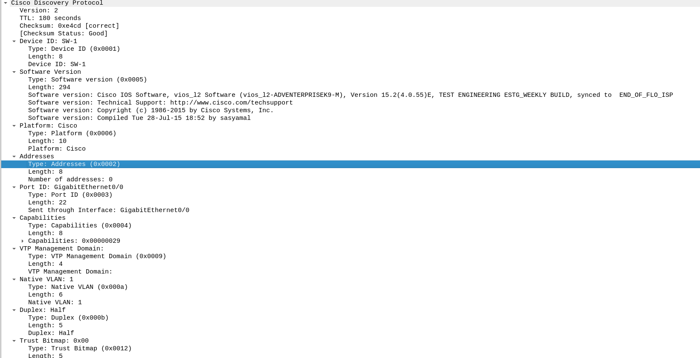

# Sécuriser - CDP et LLDP :

## 0 Le laboratoire :
Voici le laboratoire que j'utilise pour tester la sécurité des protocoles CDP et LLDP :


Adressage MAC :

Nom | @MAC 
---|---
KALI | 00:0C:29:05:A1:31 |
SW-1 | 0C:44:BE:18:8F:00 |

## 1 Le protocole CDP :
### 1.1 Activer CDP :
Par CDP est actif sur tous les ports d'un equipements Cisco, mais il est possible de l'activer comme ceci :
````text
SW-1(config)# cdp run
````

Ou uniquement de l'activer sur une interface :
````text
SW-1(config)# interface GigabitEthernet 0/0
SW-1(config)# cdp enable
````

### 1.2 Désactiver CDP :
Pour désactiver CDP globalement :
````text
SW-1(config)# no cdp run
````

Ou le désactiver sur un ou des port(s) spécifique(s) :
````text
SW-1(config)# interface GigabitEthernet 0/0
SW-1(config)# no cdp enable
````

### 1.3 Voir les voisins CDP depuis Kali :
Depuis la VM KALI, utilisation de  Wireshark avec le filtre **cdp** :


### 1.4 Voir les voisins CDP depuis Cisco :
Sur un switch Cisco pour voir les voisins :
````text
SW-1# show cdp neighbors detail
````

## 2 Le protocole LLDP :
### 2.1 Activer LLDP :
Le protocole LLDP n'est pas par défaut actif sur les équipements Cisco, mais il est possible de l'activer comme ceci :
````text
SW-1(config)# lldp run
````

Ou uniquement de l'activer sur une interface :
````text
SW-1(config)# interface GigabitEthernet 0/0
SW-1(config)# lldp transmit
````

### 1.2 Désactiver LLDP :
Pour désactiver LLDP globalement :
````text
SW-1(config)# no lldp run
````

Ou le désactiver sur un ou des port(s) spécifique(s) :
````text
SW-1(config)# interface GigabitEthernet 0/0
SW-1(config)# no lldp transmit
````

### 1.3 Voir les voisins LLDP depuis Kali :
Depuis la VM KALI, utilisation de  Wireshark avec le filtre **lldp** :


### 1.4 Voir les voisins LLDP depuis Cisco :
Sur un switch Cisco pour voir les voisins :
````text
SW-1# show lldp neighbors detail
````