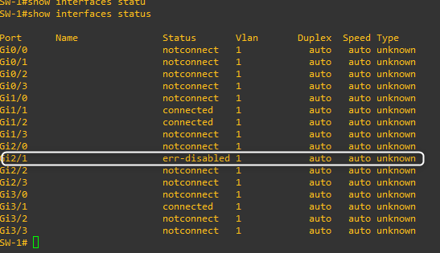

# Sécuriser - ARP et DHCP :

Ressources :

* DHCP, [https://formip.com/dhcp-snooping/](https://formip.com/dhcp-snooping/)
* DHCP, [https://medium.com/@ayushir/dhcp-snooping-attack-ca728e4dd84](https://medium.com/@ayushir/dhcp-snooping-attack-ca728e4dd84)
* ARP, [https://formip.com/dai/](https://formip.com/dai/)

---

## 0 Le laboratoire :
Voici le laboratoire que j'utilise pour tester la sécurité des protocoles DHCP et ARP :

<div align="center">***Illustration 1 :*** *Plan réseau du laboratoire.*</div>

Adressage IP et MAC :

* PC-1, DHCP, 00:50:79:66:68:00 
* PC-2, DHCP, 00:50:79:66:68:01
* DHCP, 192.168.10.31/24, 00:0C:29:07:DB:B1
* KALI, DHCP, 00:0C:29:05:A1:31
* SW-1, 192.168.10.1/24

Tous les hôtes du laboratoire sont dans le VLAN 1.

Configuration du serveur DHCP :
````text
option domain-name "example.org";
option domain-name-servers ns1.example.org, ns2.example.org;

defauylt-lease-time 600;
max-lease-time 7200;

subnet 192.168.10.0 netmask 255.255.255.0 {
	range 192.168.10.100 192.168.10.120;
	option subnet-mask 255.255.255.0;
	option broadcast-address 192.168.10.255;
}
````

---

## 1 Sécuriser le protocole DHCP :
Les attaques sur le protocole DHCP :

* DHCP Starvation, reserver tous ls baux du serveur DHCP. Ce qui à pour conséquence que les clients n'obtienent plus de configuration IP.
* DHCP Spoofing, un attaquant distribue des configuration IP ou il se définit en tant que passerelle. Ce qui permet de réaliser un MITM,

---

### 1.1 Miitigation :
#### 1.1.1 DHCP Snooping :
Mise en place du DHCP snooping sur le **VLAN 1** :
````text
SW-1(config)# ip dhcp snooping
SW-1(config)# ip dhcp snooping vlan 1
SW-1(config)# no ip dhcp snooping information option
````

Détail des commandes :
* 1 Activation du DHCP Snooping globalement,
* 2 Activation du DHCP Snooping sur le VLAN 1, **étape nécessaire** sans celle-ci le DHCP snooping n'est pas fonctionnel,
* 3 L'activation globale du DHCP snooping active l'option DHCP 82, 

Option 82 définition :
**Cette option spécifie le réseau source de la demande, dans une architecture réseau ou le serveur DHCP se trouve dans un sous réseau différent. La trame est relayer par le routeur via l'agent relai. Dans ce contexte un switch ou un routeur peut ajouter dans l'option 82 le réseau source de la demande DHCP.
Certain serveur DHCP n'accepte pas l'option 82, il peut être nécessaire de la désactiver.**

Trust du port **GigabitEthernet 3/1** du switch **SW-1** ou le serveur **DHCP** est connecté :
````text
SW-1(config)# interface GigabitEthernet 3/1
SW-1(config-if)# ip dhcp snooping trust
SW-1(config-if)# ip dhcp snooping limit rate 80
````

Détail des commandes :
* 1 Sélection de l'interface,
* 2 Trust de l'interface
* 3 Mise en place d'un quota, dans l'exemple ce port est limité à 80 requêtes DHCP/secondes.

#### 1.1.2 Port Security :
Le port-security limite le nombre d'adresse MAC référencé sur un port.
Ce qui à pour conséquence direct de mitiguer l'attaque DHCP Starvation

Sur le switch **SW-1** sur le port de **PC-1** :
````text
SW-1(config)# interface GigabitEthernet 1/1
SW-1(config-if)# switchport mode access
SW-1(config-if)# switchport port-security
SW-1(config-if)# switchport port-security max 3
SW-1(config-if)# switchport port-security violation shutdown
SW-1(config-if)# exit
````

Sur le switch **SW-1** sur le port de **PC-2** :
````text
SW-1(config)# interface GigabitEthernet 1/2
SW-1(config-if)# switchport mode access
SW-1(config-if)# switchport port-security max 3
SW-1(config-if)# switchport port-security violation shutdown
SW-1(config-if)# exit
````

Sur le switch **SW-1** sur le port de **KALI** :
````text
SW-1(config)# interface GigabitEthernet 2/1
SW-1(config-if)# switchport mode access
SW-1(config-if)# switchport port-security max 3
SW-1(config-if)# switchport port-security violation shutdown
SW-1(config-if)# exit
````

Si il y a plus de trois adresse MAC associé à un port dans la table CAM du switch **SW-1**, le port en question est éteint (shutdown).
Cette limitation permet de "voler" au maximum trois baux par le pirate.

---

### 1.2 Vérification :
#### 1.2.1 Vérification DHCP Snooping :
Commandes pour vérifier le DHCP snooping :
`````text
SW-1# show ip dhcp snooping
`````


<div align="center">***Illustration 2 :*** *Vérification des ports trusts.*</div>

Il est possible de noter : 
* L'option 82 est désactivé,
* L'interface **GigabitEthernet 3/1** est une interface trust par le switch SW-1 pour les trames DHCP,

Commandes pour voir les baux DHCP distribués (table DHCP Snooping) :
`````text
SW-1# show ip dhcp snooping binding
`````


<div align="center">***Illustration 3 :*** *Vérification des baux DHCP.*</div>

Dans cette capture il est possible de voir que le DHCP à distribué trois baux DHCP, on y retrouve :

* L'adresse MAC du client,
* L'adresse IP distribué par le DHCP,
* Lease time du bail DHCP,
* L'interface du client,

Il est possible de clear la table DHCP Snooping :
`````text
SW-1# clear ip dhcp snooping binding *
`````

#### 1.2.1 Vérification Port Security :
Voir les ports définis en tant que port security :
````text
SW-1# show port-security
````


<div align="center">***Illustration 4 :*** *Port security configuration initiale.*</div>

Nous pouvons remarqué que le port security permet à chaque port, trois adresses MAC différentes au maximum.
Une adresse MAC est déja utilisé sur chaque port il en reste donc deux de disponible.

---

### 1.3 Tentative d'attaque :
#### 1.3.1 DHCP Starvation :
Pour rappel le port security est actif est configurer pour autoriser trois adresses MAC différentes sur chaques port du switch SW-1.

Utilisation de yersinia, depuis la VM KALI :
````bash
yersinia -G
````

**onglet DHCP -> DHCP Starvation -> OK**

Après un cours instant, la VM KALI réalise un nombre infinie de requête DHCP Discover dans l'objectif d'utiliser tous les baux DHCP du serveur DHCP.

Mais le port security limite à un maximum de trois adresses MAC sur le port ou est connecté KALI (donc 3 demande DHCP Discover).
Ce qui à pour conséquence de placer le port en mode **err-disabled** et de le rendre inutilisable.

Aperçu :
````text
SW-1# show port-security
SW-1# show interface status
````


<div align="center">***Illustration 5 :*** *Status du port security après l'attaque.*</div>


<div align="center">***Illustration 6 :*** *Port désactivé zpar le DHCP snooping.*</div>

Pour rendre ce port à nouveau fonctionnel :
````text
SW-1(config)# interface GigabitEthernet 2/1
SW-1(config-if)# shutdown
SW-1(config-if)# no shutdown
````

---

#### 1.3.2 DHCP Spoofing :
Pour rappel seul le port vers le serveur DHCP **GigabitEthernet 3/1** est trust pour les trames DHCP Offer.

Utilisation de ethercap, depuis la **VM KALI** :
````bash
ettercap -G
````

Afin d'obtenir de meilleur résultat, j'arrete le service DHCP du serveur DHCP :
````bash
/etc/init.d/isc-dhcp-server stop
````

Malgrès que la **VM KALI** distribue des baux DHCP, aucun poste obtient une configuration IP.

Mais si je place l'interface de la **VM KALI** en mode **DHCP Snooping trust** :
````text
SW-1(config)# interface GigabitEthernet 2/1
SW-1(config-if)# ip dhcp snooping trust
````

Puis que je renouvelle ma demande DHCP depuis **PC-1** et **PC-2** :
````text
PC-1> ip dhcp
PC-2> ip dhcp
````

Les postes obtiennent une configuration IP.

Depuis Ethercap :

<div align="center">***Illustration 7 :*** *Log d'ethercap.*</div>

Configuration IP des postes :
````text
PC-1> show ip
````


<div align="center">***Illustration 8 :*** *Bail DHCP des postes.*</div>

Nous pouvons remarquer que la valeur de la passerelle des configurations IP des postes correspond à l'adresse IP de la **VM KALI**.
Cette action à uniquement été possible car j'ai placé le port de la **VM KALI** en mode **DHCP Snooping trust**.
Sans cette modifications les postes n'aurai jamais pu obtenir un bail DHCP.

---

## 2 Sécuriser le protocole ARP :  
Pour sécuriser le protocole ARP, il est possible de s'appuyer sur la fonctionalité **DHCP snooping**.
En effet le **DHCP Snooping** construit une table de correspondance qui référence l'adresse MAC et l'adresse IP des baux DHCP.

Il est possible de consulter cette table de correspondance via la commande :
````text
show ip dhcp snooping binding
````
La fonctionalité dans Cisco IOS qui s'appuie sur la table de correspondance du **DHCP Snooping** pour éviter les attaques ARP est le **DAI, Dynamic ARP Inspection**.

Description du procédé, les adresses MAC et les adresses IP sont analysés dans toutes les trames :
* Cas 1, La correspondance est référencé dans la table **DHCP Snooping** => le switch forward la trame,
* Cas 2, La correspondance n'est pas référencé dans la table **DHCP Snooping** mais elle à été définis dans une entrée statique => le switch forward la trame,
* Cas 3, La correspondance n'est pas référencé dans la table **DHCP Snooping** et elle n'est pas définis comme une entrée statique => le switch drop la trame,

---

### 2.1 Définir les IP statiques :
Dans le laboratoire, le serveur **DHCP** est définis en configuration IP statique.
Son association adresse MAC adresse IP n'est pas connu par la fonction DHCP Snooping du switch. 
Il est donc nécessaire de trust le serveur **DHCP**.

Pour cela deux possibilitées :

* Méthode 1, trust du port du serveur DHCP,
* Méthode 2, rust de l'association adresse MAC et adresse IP,

Méthode 1, trust du port du serveur **DHCP** par le **DHCP snooping** :
````text
SW-1(config)# interface GigabitEthernet 3/1
SW-1(config-if)# ip arp inspection trust
````

Méthode 2, trust de l'association adresse MAC et adresse IP du serveur **DHCP**:
````text
SW-1(config)# access-list ARP-TRUST
SW-1(config-nacl)# permit ip 192.168.10.31 mac 00:0C:29:07:DB:B1
SW-1(config-nacl)# exit
SW-1(config)# ip arp inspection filter ARP-TRUST vlan 1
````

La première méthode est plus facile à utiliser mais moins sécurisé, elle n'empechera pas uen attaque ARP mais elle fera juste confiance au port.
Tandis que la seconde méthode accepte uniquement une association adresse IP et MAC.
Je recommande dutiliser la seconde méthode.

---

### 2.1 Mise en place du DAI :
Pour mettre en place **DAI** (se base sur la table DHCP Snooping) :
````text
SW-1(config)# ip arp inspection vlan 1
````

---

### 2.2 Tentative d'attaque :
Depuis KALI je vais tenter d'empoisoner la table ARP de **PC-1** pour me faire passer pour **PC-2**, la table ARP de **PC-1** est actuellement vide.

Pour rappel :

* PC-1 : 00:50:79:66:68:00, 192.168.10.118
* PC-2 : 00:50:79:66:68:01, 192.168.10.120
* KALI : 00:0C:29:05:A1:31, 192.168.10.104

Depuis la VM KALI :
````bash
arpspoof -t 192.168.10.118 192.168.10.120
````

Traduction littérale :
Auprès de **PC-1** (192.168.10.118), fait moi passer pour **PC-2** (192.168.10.120).

Sur le poste le cache ARP est vide :
````text
PC-1> show arp
````


<div align="center">***Illustration 9 :*** *Cache ARP de la victime.*</div>

Mais depuis le switch SW-1, il est possible d'observer ces lignes de logs :


<div align="center">***Illustration 10 :*** *Ligne de log depuis SW-1 dans la console.*</div>

Le switch **SW-1** à détecté que la VM KALI envoie des réponses ARP falsifiés car  l'association adresse MAC et adresse IP n'est pas présente :

* Dans le cache DHCP snooping,
* Dans une ACL ou dans un trust de port,

Ce qui à pour conséquence que le switch SW-1 drop les trames.

---

## 3 Conclusion :
Pour conclure sur la sécurité des protocoles DHCP et ARP :

* Attaque DHCP Starvation -> Port Security,
* Attaque DHCP Spoofing -> DHCP Snooping,
* Attaque ARP Spoofing -> DAI avec DHCP Snooping,