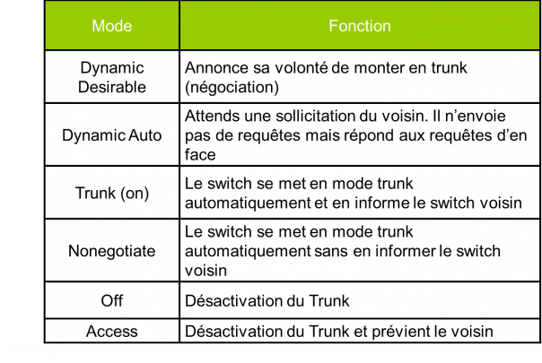
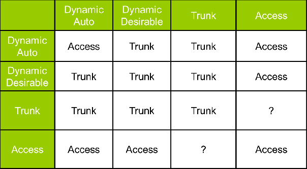

# Sécuriser - Les VLAN :

Ressource :

* [https://cybersecurity.att.com/blogs/security-essentials/vlan-hopping-and-mitigation](https://cybersecurity.att.com/blogs/security-essentials/vlan-hopping-and-mitigation)
* [https://www.notsosecure.com/exploiting-vlan-double-tagging/](https://www.notsosecure.com/exploiting-vlan-double-tagging/)
* [https://networklessons.com/cisco/ccnp-switch/vlan-hopping](https://networklessons.com/cisco/ccnp-switch/vlan-hopping)

Cette documentation illustre les méthodes pour mitiguer les attaques de rebonds des VLAN.
Il existe deux méthodes pour réaliser cette attaque :

* Double tag,
* Protocole DTP,

---

## 1 Le double tag :
### 1.1 Le laboratoire :
Voici le laboratoire que j'utilise pour ce lab :

<div align="center">***Illustration 1 :*** *Plan réseau du laboratoire.*</div>

Ce lab est composer d'un VLAN :

* VLAN 10 ; 192.168.10.0/24

Le PC-1 se rouve dans le VLAN 10 et l'attaquant dajns le VLAN 1 (par défaut).
Une liason **trunk** est entre le switch SW-1 et le dwitch SW-2.

Script de configuration du switch SW-1 :
````text
SW-1(config)# vlan 1
SW-1(config-vlan)# no shutdown
SW-1(config-vlan)# exit

SW-1(config)# vlan 10
SW-1(config-vlan)# name vlan_1
SW-1(config-vlan)# no shutdown
SW-1(config-vlan)# exit

SW-1(config)# interface vlan 10
SW-1(config-if)# ip address 192.168.10.10 255.255.255.0
SW-1(config-if)#no shutdown
SW-1(config-if)# exit

SW-1(config)# interface GigabitEthernet0/0
SW-1(config-if)# switchport mode access
SW-1(config-if)# switchport access vlan 10
SW-1(config-if)# no shutdown
SW-1(config-if)# exit

SW-1(config)# interface GigabitEthernet3/0
SW-1(config-if)# switchport trunk encapsulation dot1q
SW-1(config-if)# switchport mode trunk
SW-1(config-if)# switchport trunk allowed vlan 10
SW-1(config-if)# switchport trunk native vlan 1
SW-1(config-if)# no shutdown
SW-1(config-if)# exit

SW-1(config)# hostname SW-1
SW-1(config)# do wr
````

Script de configuration du switch SW-2 :
````text
SW-2(config)# vlan 1
SW-2(config-vlan)# no shutdown
SW-2(config-vlan)# exit

SW-2(config)# vlan 10
SW-2(config-vlan)# name vlan_1
SW-2(config-vlan)# no shutdown
SW-2(config-vlan)# exit

SW-2(config)# interface vlan 10
SW-2(config-if)# ip address 192.168.10.20 255.255.255.0
SW-2(config-if)# no shutdown
SW-2(config-if)# exit

SW-2(config)# interface GigabitEthernet0/0
SW-2(config-if)# switchport mode access
SW-2(config-if)# switchport access vlan 1
SW-2(config-if)# no shutdown
SW-2(config-if)# exit

SW-2(config)# interface GigabitEthernet3/0
SW-2(config-if)# switchport trunk encapsulation dot1q
SW-2(config-if)# switchport mode trunk
SW-2(config-if)# switchport trunk allowed vlan 10
SW-2(config-if)# switchport trunk native vlan 1
SW-2(config-if)# no shutdown
SW-2(config-if)# exit

SW-2(config)# hostname SW-2
SW-2(config)# do wr
````

---

### 1.2 Explications :
Cette attaque est possible uniquement quand une liason trunk est configuré entre deux switch.
Pour rappel la norme dot1q ajoute un champ dans les trames ethernet, ce champ specifie le numéros du vlan qui est associé à la trame.
L'objectif de cette action est de diffusé uniquement la trame au vlan associé.

Par exemple une trame de demande ARP est émise par un poste elle est diffusé dans le VLAN 10 :

* 1 Le switch regarde les ports qui sont positionné dans le VLAN 10 et transmet la trame,
* 2 Ensuite le switch ajoute un champ **VLAN_ID** dans la trame ethernet qui correspond au numéros de VLAN (VLAN 10),
* 3 Le switch transmet cette trame au second switch,
* 4 Le second switch ouvre la trame récupère la valeur de VLAN_ID,
* 5 Et il transmet la trame aux ports configurés dans le VLAN 10,

Dans ce contexte, le poste envoie au switch (avant l'étape 1) une trame doublement entaguée :

<div align="center">***Illustration 2 :*** *Trame double tag.*</div>

L'attaquant envoie une trame avec deux balise 802.1Q :

* La balise interne correspond au vlan natif,
* La balise externe correspond au vlan que l'attaquant souhaite contacter,

Le switch reçoit cette trame et il effectue les actions suivantes :

* 1 Supprime la première entête 802.1Q (vlan natif),
* 2 Il relais la trame à l'ID de vlan de la seconde entête,

Définition VLAN natif :

***Certaines trames véhiculées sur un trunk ne sont pas marquées d’un tag dot1q.
Dés lors il faut pouvoir les placer quelque part. C’est là qu’intervient le vlan natif.
Le vlan natif, est le vlan dans lequel sont véhiculées les trames non taguées dot1q.
Donc si un switch reçoit sur une interface trunk une trame ethernet standard, il la placera dans ce vlan natif, en quelque sorte, un vlan par défaut (de marquage).
Sur les équipements Cisco, certains protocoles comme CDP ou DTP sont véhiculés dans des trames non taguées et donc dans le vlan natif.***

Le vlan natif est utilisé lorsqu'un port configuré en trunk reçoit une trame non taguée.
Lorsqu'un port trunk reçoit une trame non taguée il l'envoie dans le vlan natif.

Par défaut le vlan natif est le vlan 1 sur les witchs Cisco.
L'attaque de double tag est unidirectionnel l'attaquant peux envoyer des trames mais il n'obtiendra pas de réponse.
Ce qui permet par exemple de réaliser un DoS.

---

### 1.3 Attaque :
A l'aide de scapy l'attaquant envoie ce paquet :
````python
scapy
sendp(Ether(dst='ff:ff:ff:ff:ff:ff', src='0E:5C:49:19:32:BF')/Dot1Q(vlan=1)/Dot1Q(vlan=20)/IP(dst='255.255.255.255', src='192.168.10.1')/ICMP(), iface='eth0')
````

---

### 1.4 Mitigation :

Pour mitiger l'attaque double tagged il faut changer la valeur du vlan natif celui doit correspondre à deux critères :

* Dédié un vlan uniquement à cet usage,
* Le VLAN natif doit être identique entre les liasons trunk,

Mitigations sur SW-1 :
````text
SW-1(config)# vlan 99
SW-1(config-vlan)# name natif
SW-1(config-vlan)# no shutdown
SW-1(config-vlan)# exit

SW-1(config)# interface GigabitEthernet 3/0
SW-1(config-if)# switchport trunk native vlan 99
SW-1(config-if)# exit
````

Mitigations sur SW-2 :
````text
SW-2(config)# vlan 99
SW-2(config-vlan)# name natif
SW-2(config-vlan)# no shutdown
SW-2(config-vlan)# exit

SW-2(config)# interface GigabitEthernet 3/0
SW-2(config-if)# switchport trunk native vlan 99
SW-2(config-if)# exit
````

---

## 2 Le protocole DTP :
### 2.1 Le laboratoire :
Voici le laboratoire que j'utilise pour ce lab :

<div align="center">***Illustration 3 :*** *Plan du laboratoire.*</div>

Voici le script de configuration du switch SW-1 :
````text
SW-2(config)# interface GigabitEthernet0/0
SW-2(config-if)# switchport mode dynamic auto
SW-2(config-if)# exit

SW-2(config)# hostname SW-1
SW-2(config)# do wr
````

---

### 2.2 Explications :
Le protocole DTP (Dynamic Trunk Protocol) est un protocole propriétaire Cisco qui permet de négocier les liason trunk avec d'autres équipement Cisco.
Par défaut il est activé et il permet à un attaquant de monter une liason trunk entreson PC et le switch.
Ce qui à pour conséquence qu'il peut détourner tous les vlan configurés sur le switch.

Il existe plusieurs mode DTP :

<div align="center">***Illustration 4 :*** *Mode DTP.*</div>

Et ces mode mènent à plusieurs résultats :

<div align="center">***Illustration 5 :*** *Association des modes DTP.*</div>

---

### 2.3 Attaque :
Aparavant, je m'assure qu'aucun port et à monter une liason trunk :
````text
SW-1# show interface trunk
````

Aucun retour donc aucune interfac n'a été monté en trunk.
Ensuite avec yersinia :
````bash
yersinia -G
````

Je me rend dans DTP -> Launc attack -> Enabling trunking -> OK

Je retourne sur le switch :
````text
SW-1# show interface trunk
````


<div align="center">***Illustration 6 :*** *Port de cascade.*</div>

L'interface de l'attaquant est monté en trunk.

---

### 2.4 Mitigation :
Il faut désactiver le protocle DTP vers tous les postes clients :
````text
SW-1(config)# interface <toutes-les-interfaces-vers-les-clients>
SW-1(config-if)# switchport mode access
SW-1(config-if)# switchport nonegotiate
````

Je recommande de priviligé de désactiver DTP sur les ports de cascades et de monter manuellement les liasons trunk.

---

## 3 Conclusion :
Nous avons vu deux attaques sur les vlan :

* Double tagging
* Switch spoof

Pour mitiguer ces deux attaques :
* Changer la valeur du vlan natif et ne pas laisser de ports de clients dans un vlan qui n'est pas définis en access sur un vlan précis,
* Désactiver le protocole DTP sur tous les ports 

---