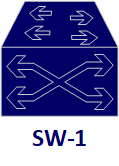

# Sécuriser - Les mots de passe sur Cisco :

Ressource :
 * https://cisco.goffinet.org/ccna/gestion-securisee-peripheriques/chiffrement-des-mots-de-passes-locaux-cisco-ios/

## 0 Le laboratoire :
Voici le laboratoire que j'utilise pour ce sujet :


Il est possible de distinguer deux accès aux équipements Cisco :
 * out-band ; accès par la console (qui ne nécessite pas de configuration réseau ; ex câble console etc.),
 * in-band ; accès par un service réseau (nécessite une configuration IP ; ex SSH etc.),

## 1 Accès out-band :
Pour définir un mot de passe pour l'accès à la console de manière sécurisé j'utilise l'algorithme scrypt.

Par exemple avec le mot de passe **test** :
````text
SW-1(config)# enable algorithm-type scrypt secret test
````

Le mot de passe est définis en type 9 tandis que le sha-256 est définis en type 8. Donc le scrypt apporte un gain de sécurité.

Lorsque l'on regarde la configartion :
````text
SW-1# sh run
````


Nous pouvons constater que le mot de passe est de type 9 et chiffré.

## 2 Accès in-band :
Pour avoir un accès in-band il est necessaire d'avoir une configuration IP.

### 2.1 Activer SSH :

Prérequis :
````text
SW-1(config)# ip domain-name test.com
SW-1(config)# crypto key generate rsa modulus 4096
````

1. Définir un nom de domaine pour la paire de clée,
2. Générer la paire de clée,

Activer SSH :
````text
SW-1(config)# ip ssh version 2
SW-1(config)# line vty 0 15
SW-1(config-line)# login local
SW-1(config-line)# transport input ssh
SW-1(config-line)# exit
````

1. Activer le protocole SSH,
2. Séléctionner les terminaux virtuels 0 à 15,
3. Spécifier une authentification locale,
4. Spécifier que l'on utilise SSH sur ces terminaux,

### 2.2 Créer un administrateur :
Création d'un administrateur **admin** avec le mot de passe **test** :
````text
SW-1(config)# username admin privilege 15 algorithm-type scrypt secret test
````

L'option **privilege 15** spécifie que cet utilisateur à les droits administrateur sur le switch.

Lorsque l'on regarde la configuration, on peut voir les deux mots de passe chiffrés :


Les deux mots de passe sont de type 9 en scrypt.

Enfin on active la fonction qui permet de chiffrer des mots de passe :
````text
SW-1(config)# service password-encryption
````

Cette fonction chiffre tous les mots de passe en clair dans la configuration et les potentiels mots de passe ajoutés dans le future.
