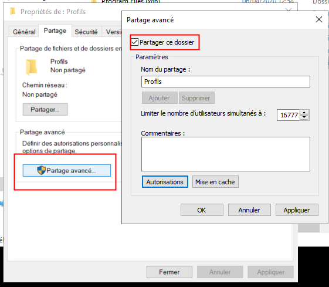
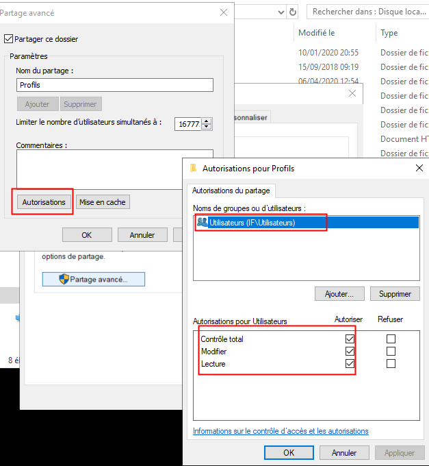
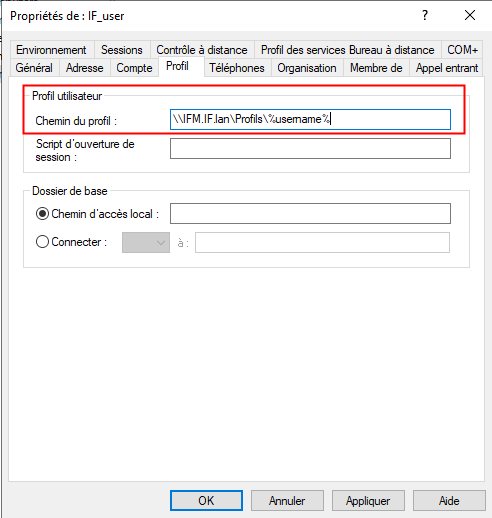

# Profils itinérants :

Les profiles itinérants au seins des infrastructures Active Directory permettent de récupérer les données utilisateurs même en ca de panne du poste utilisateur.

En effet, le profil de l'utilisateur n'est plus stocké dans son poste mais dans l'Active Directory via les partages SMB.

Ressources :

* [https://www.it-connect.fr/active-directory-creer-des-profils-itinerants-pour-ses-utilisateurs/](https://www.it-connect.fr/active-directory-creer-des-profils-itinerants-pour-ses-utilisateurs/)

---

## 1 Création d'un répertoire de stockage :
Au sein du serveur de fichier, je créer un nouveau répertoire :
````powershell
mkdir C:\Profils
````

Ce repertoire stockera les profils des utilisateurs itinérants.

Ensuite, je modifie partage ce repertoire (**Clic droit** -> **Propriété** -> **Partage**):


Enfin, je modifie les droits de ce repertoire (**Autorisation**), pour définir le groupe **Utilisateurs (IF\Utilisateurs**) avec tous les droits associés : 


Appliquer tous les paramètres.

---

## 2 Configuration de l'utilisateur :
Le chemin UNC pour atteindre le répertoire **C:\Profils** est le suivant :
````text
\\IFM.IF.lan\Profils
````

Mais il est nécessaire de rajouter le nom d'utilisateur, il est possible d'utiliser la variable d'envionement **%username%** pour automatiser le process, ce qui nous donnes :
````text
\\IFM.IF.lan\Profils\%username%
````

Pour configurer un profil itinérant, il faut se rendre dans la console **Utilisateurs et ordinateurs**, onglet **profil** :


